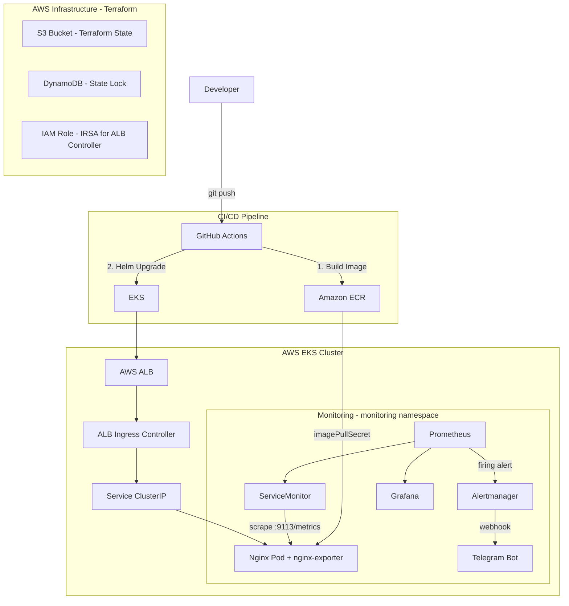

# DevOps Interview Project

一個完整的 Production-level DevOps 實作專案，涵蓋從基礎設施建置到應用部署、監控告警的完整流程。

---

## 架構總覽



---

## 技術棧

| 類別 | 工具 |
|------|------|
| Infrastructure as Code | Terraform |
| Cloud Provider | AWS (EKS, ECR, ALB, IAM, S3, DynamoDB) |
| Container Orchestration | Amazon EKS (Kubernetes) |
| Package Management | Helm |
| CI/CD | GitHub Actions |
| Container Registry | Amazon ECR (Private) |
| Monitoring | kube-prometheus-stack (Prometheus + Grafana + Alertmanager) |
| Alerting | Telegram Bot |

---

## 專案結構

```
.
├── .github/workflows/
│   └── ci-cd-ecr.yaml        # CI: build image → ECR / CD: helm upgrade → EKS
├── app/
│   └── index.html            # 網站內容
├── docker/
│   ├── Dockerfile
│   └── nginx.conf
├── helm/
│   ├── nginx-chart/          # 應用 Helm Chart（nginx + exporter sidecar）
│   ├── kube-prometheus-stack/ # Prometheus stack values（alert rules、alertmanager config）
│   └── aws-load-balancer-controller/ # ALB Controller values
├── k8s/
│   └── setup/                # 一次性手動部署的 Kubernetes 資源
│       ├── ServiceAccount.yaml        # ALB Controller IRSA SA
│       ├── alertmanager-config.yaml   # Alertmanager Telegram 設定
│       └── servicemonitor.yaml        # Prometheus 監控目標設定
├── scripts/
│   ├── setup-terraform-backend.sh    # 建立 S3 + DynamoDB（只需執行一次）
│   ├── setup-ecr.sh                  # 建立 ECR repository（只需執行一次）
│   ├── setup-monitoring.sh           # 安裝監控 stack（模板版）
│   └── test-rollback-alert.sh        # 測試 helm rollback + 告警
└── terraform/eks/            # EKS + VPC + IAM 基礎設施
```

---

## CI/CD 流程

```
git push main
    │
    ▼
[CI Job]
  1. Build Docker Image（tag = git commit SHA）
  2. Push Image 到 Amazon ECR
    │
    ▼
[CD Job]
  3. aws eks update-kubeconfig
  4. helm upgrade my-nginx（使用新的 image tag）
    │
    ▼
EKS Rolling Update（零停機更新）
```

---

## 監控架構

```
nginx Pod（:80）
    │
nginx-exporter sidecar（:9113/metrics）
    │
ServiceMonitor（Prometheus Operator CRD）
    │
Prometheus（定期 scrape）
    │
AlertRule 觸發（AppDown / MyNginxScaledToZero）
    │
Alertmanager
    │
Telegram Bot 通知
```

**告警規則：**
- `MyNginxScaledToZero`：replicas 縮到 0 時立即觸發
- `AppDown`：available replicas 為 0 持續 1 分鐘觸發

---

## 從零開始部署

### 前置條件（只需執行一次）

```bash
# 1. Terraform Backend（S3 + DynamoDB）
bash scripts/setup-terraform-backend.sh

# 2. ECR Repository
bash scripts/setup-ecr.sh
```

### 每次重建 EKS 後的執行順序

```bash
# Step 1：建立 AWS 基礎設施
cd terraform/eks
terraform init
terraform apply

# Step 2：連線到 cluster
aws eks update-kubeconfig --region ap-northeast-1 --name devops-eks

# Step 3：建立 ALB Controller ServiceAccount（IRSA）
kubectl apply -f k8s/setup/ServiceAccount.yaml

# Step 4：安裝 ALB Controller
helm upgrade --install aws-load-balancer-controller \
  eks/aws-load-balancer-controller \
  -n kube-system \
  -f helm/aws-load-balancer-controller/values.yaml

# Step 5：安裝監控 Stack + 建立 Secrets
bash scripts/setup-monitoring.local.sh

# Step 6：部署應用（擇一）
git push                    # 觸發 CI/CD（推薦）
# 或
helm upgrade --install my-nginx ./helm/nginx-chart
```

### 依賴順序說明

```
terraform apply
    ↓ （建立 EKS 和 IAM Role）
ServiceAccount（IRSA annotation 指向 IAM Role）
    ↓ （SA 必須存在，ALB Controller 才能取得 AWS 權限）
ALB Controller
    ↓ （ALB Controller 就緒後，Ingress 才能建立 ALB）
nginx deployment（Ingress 生效）

setup-monitoring（可與 ALB Controller 並行）
    ↓ namespace → Telegram Secret → helm install prometheus → alertmanager-config → servicemonitor
```

---

## 測試告警

```bash
# 觸發告警
kubectl scale deploy my-nginx-nginx-chart --replicas=0

# 恢復
kubectl scale deploy my-nginx-nginx-chart --replicas=2
```

---

## 重要設計決策

**為什麼用 IRSA？**
ALB Controller 需要 AWS 權限來建立/管理 ALB。IRSA 讓 Kubernetes ServiceAccount 直接綁定 IAM Role，不需要在 Pod 內放 AWS credentials，更安全。

**為什麼 Terraform state 放 S3？**
本地 state 無法多人協作，且容易遺失。S3 + DynamoDB 提供共用儲存和防止同時寫入的 lock 機制。

**為什麼 image 改用 ECR？**
Docker Hub 是公開的，production 環境應使用私有 registry。ECR 與 AWS IAM 整合，EKS Node 可透過 IAM Role 直接 pull image，不需要額外管理 credentials。

**為什麼 Alertmanager config 用獨立 Secret（不放 Helm values）？**
Prometheus Operator 的 config validation 不支援 `chat_id_file` 等較新欄位。使用 `configSecret` 繞過 Operator 的 schema 驗證，同時讓 bot_token 以 file 形式掛載（不明文出現在 config 中）。
